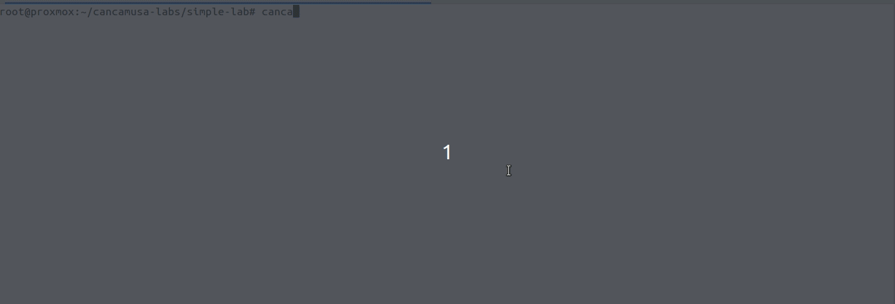
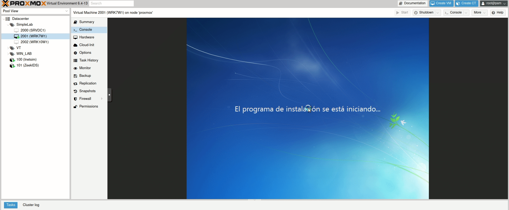

# Cancamusa 
> **Laboratorio de Carton-Piedra**

A Deception Platform

## Configuration
The cancamusa configuration is stored by default in `~/.cancamusa/preferences.json` and can be changed using the ENV_VAR **CANCAMUSA_HOME**

## Installation

Set cancamusa command as a bash alias:
```
alias cancamusa='python3 ~/Workspace/cancamusa/cancamusa.py'
```

Install the required libraries: 
```
apt-get install wimtools git acpica-tools
```

Install python requirements:
```
python3 -m pip install -r requiremets.txt
```

## Examples

There are some laboratory examples here: https://github.com/SecSamDev/cancamusa-labs

## How to use it



Inside an empty directory type `cancamusa`:
```
test1@Test1:~/cancamusa-labs/test2$ cancamusa
Not a valid cancamusa project
? No project found in the current path. Want to create a new Cancamusa project?  Yes
? Name of the project  test2
? Description of the project  Malware laboratory
? Configure a SIEM to send Windows Logs?  No
? Install Sysmon in each host?  No
? Select a project property:  
  > Description
  > Edit hosts
  > AD
  > SIEM
  > Rebuild
  > Build
  > Deploy
  > Exit
```
This interactive menu will help you configure a full windows platform.

#### Edit hosts
This will give you power to customize each host in your new network:
```
? Select a project property:  Edit hosts
  > Add Host
  > Import hosts
  > Edit QEMU start ID
  > Back
? Host edition mode Add host
? Editing host: Windows
  > Name
  > Disks
  > Bios
  > RAM
  > CPUs
  > Accounts
  > Domain
  > Roles
  > Network interfaces
  > OS Version
  > Resume
  > Back
  > Cancel
```
The name option will edit the hostname, "Disks" for adding disks, "Bios" for customizing the bios of the machine, when building the project, this will generate a .bin file of a modified version of SeaBIOS; "Accounts" for adding/editing accounts, "Network interfaces" for adding/editing new network interfaces and customize its address.
```
? Select a project property:  Edit hosts
? Host edition mode  Add host
? Editing host: Windows  Name
? Edit Hostname   Windows123
? Editing host: Windows123  Disks
? Modify disks  Add
? Select device ID  C
? Volume name  TestDiskWindows123
? Disk Size.  512G
? Editing host: Windows123  Cancel
? Host edition mode  Back
? Select a project property:  Exit
```

Now editing the bios version:
```
? Editing host: Windows123  Bios
? Edit: caption  BIOS Date: 05/30/14 21:22:47 Ver: 04.06.05
? Edit: description  BIOS Date: 05/30/14 21:22:47 Ver: 04.06.05
? Edit: embedded_controller_major_version  255
? Edit: embedded_controller_minor_version  255
? Edit: manufacturer  American Megatrends Inc.
? Edit: name  BIOS Date: 05/30/14 21:22:47 Ver: 04.06.05
? Edit: ps_computer_name  Windows123
? Edit: release_date  20140530000000.000000+000
? Edit: smbios_bios_version  F5
? Edit: smbios_major_version  2
? Edit: smbios_minor_version  7
? Edit: software_element_id  BIOS Date: 05/30/14 21:22:47 Ver: 04.06.05
? Edit: software_element_state  3
? Edit: system_bios_major_version  4
? Edit: system_bios_minor_version  6
? Edit: version  ALASKA - 1072009
```
This information is used to compile a custom SeaBIOS, so each host will have a different BIOS.

The network interfaces selecting a "Random device", we can search for a custom vendor (See mac-vendor.txt):
```
? Editing host: Windows123  Network interfaces
? Modify interfaces  Add
? Network edition mode  Random device
? Edit IP assignation method
  > static
  > dynamic
  > fixed
? Edit: description  KARDIOS SYSTEMS CORP.
? Edit: dns_domain  
? Edit: dns_host_name  
? Edit: index  0
? Edit: interface_index  0
? Edit IpAddress  ['192.168.0.1']
? Edit Gateway ['192.168.0.1']
? Edit Subnet ['255.255.255.0']
? Edit: mac_address  00:20:77:97:5d:31
? Edit: setting_id  {49f6db5f-228b-42db-a89a-31a78b2d6eb7}
```

We have three network configuration options:
* Static: will configure the network interface using a static IP.
* Dynamic: will use DHCP to configure the IP, the IP, gateway and subnet will be used to detect which linux bridge will be used.
* Fixed: will use DHCP but with a fixed IP. Will create a custom script to set the fixed IPs in the DHCP server.

All configurations will use the `setup-net.ps1`script to configure the network of each host.

#### Edit AD

We can create as many domains as we want with OUs, groups and users.

```
? Select a project property: AD
Domains:
? Domain edition mode: Add domain
? Domain name: cancamusa.com
? OrganizationalUnit edition mode
  > Domain name
  > Add OU
  > Import OUs
  > Account Generator
  > Default Local Admin
  > Default Local Admin Password
  > Set DC IP
  > Back
  > Cancel
? OrganizationalUnit edition mode Add OU
? OU name: Madrid
? Editing Madrid OU Add OU
? OU name: Users
? Editing Users OU Add Users
? User name: Paco Perez
? Editing account_name paco.perez
? Editing department IT
? Editing display_name Paco Perez
? Editing first_name Paco
? Editing password PacoPerez123!
? Editing second_name Perez
? OrganizationalUnit edition mode Show OU Tree
>CNCMS
  >Madrid
    >Users
      >paco.perez (User)
```
This will be used in the principal DC to create and fill the AD.

### Deception options
* Sysmon: change the name and Altitude of the driver.
* BIOS: compile a custom BIOS.
* Hide virtualization: personalization of the CPU and flags passed to KVM.
* Disks: usage of qcow2 to be able to have disks as large as we want.
* Drivers: No usage of VirtIO drivers.
* High personalizations of machine hostname and users (Avoid usage of generic names that are detected by malware).

### Windows server capabilities

#### DHCP
Configure as many servers as you want with failover enabled (if there is more than one DHCP server).

Adds as many scopes as networks has the laboratory.
Reserves IPs for each host that has a network interface in fixed or static mode.
Calculates the failover configuration

### Deployment

There are two options: soft and hard. The hard way replaces all files and qcow2 disks and the soft only deploys the new machines and updates the QEMU templates.

### AutoInstallation

With the deployment you only need to "Start" the VM and the installation will go by itself.


## TODO:
- Proxmox template creation with all scripts and drivers bundled in a ISO mounted in a CD/DVD device.
- Build custom network VirtIO drivers: https://github.com/virtio-win/kvm-guest-drivers-windows/wiki/Building-the-drivers


